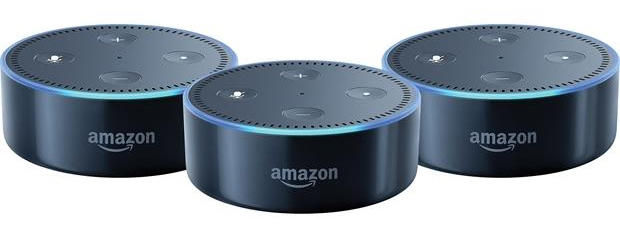

# DevNet Alexa Data Center Skill Lab

## Welcome to the DevNet Alexa Skill for Cisco UCS Management Journey (Lab)

## Overview
You are going to put together the pieces for an Alexa Skill that will let you use voice to manage Cisco Data Center Infrastructure.  In this lab your Data Center Infrastructure is represented by Cisco UCS and Cisco UCS Manager. Cisco's line of compute offerings is collectively referred to as the Unified Compute System, that's what UCS stands for and UCS Manager is one way of managing those compute resources. You don't need to know anything about UCS Manager, if you do great, but it's OK if you don't.

## Objective
You'll be using the Python code as the engine of your Alexa Skill. The Python code that makes that magic happen is already written, you just have to make a few simple changes. What you are going to do is laid out step-by-step with a brief explanation of what each step accomplishes.

Completion time: 35-45 minutes

## Resources
First let's go over the resources you are going to be using

  - Amazon Echo Dot - I'm pretty sure you know what it is, you're probably holding it in your hand right now, I bet you just looked at it.

    - The Echo is a physical device connected to the Internet.  It listens for its wake word, typically "Alexa", but the wake word could also be "Amazon", "Computer", or "Echo". Your Echo's wake word is 'Alexa'. When the wake word is heard the Echo goes into "listen" mode and awaits your request.

    - Once your request is heard, somewhere in the AWS cloud gears start to turn, and, if possible, your request is fulfilled. When you are finished with this lab you will have put in place those gears of request fulfillment.

  - AWS Services - Amazon Web Services are Services provide a place to store and run the Python code

    - Lambda - Lambda is a compute service that lets you run code without provisioning or managing servers. What that means is this, you write code and store it in AWS (S3 in this case), when you want to run that code, AWS loads it onto a server and runs it. It's that simple.

    - S3 - Simple Storage Service, it's basically a Hard-Drive in the cloud, this is where your Alexa Skill code is stored. That's the Python code mentioned earlier. In S3 your code is stored in an S3 Bucket, the bucket you'll be using is called "devnet-XX" where the "XX" is replaced with your Echo two digit number.

      AWS Services:

        

  - AWS CLI - The AWS Command Line Interface (CLI) provides commands for you to interact with AWS right at the command line on your computer.

    - For example, the command 'ls' lists the contents of a directory on Linux. In the AWS CLI the command 'aws s3 ls' lists the contents of your S3 storage (remember it's just a hard-disk in the cloud)

  - Amazon Developer Portal - The Amazon Developer Portal is where you create your Alexa Skill.

    - Creating an Alexa Skill consists of defining the utterances (spoken phrases) that get tuned into triggers (requests) to make your code stored in S3 execute as a Lambda function.

Remember, that the code was already written, you are going to need to use some programming tools to get the code ready to run as a Lambda function, these tools are:

  - Git - Git is a command line utility that will allow you to get a copy of the code for the Lambda function onto the computer you are using.

    - The code for this lab is stored in a github repository or 'repo' at https://github.com/movinalot/devnet-alexa.

    - All the code you need is in that 'repo' and you'll use 'git' to get a copy if it.

  - Python - Python is a programming language

  - Python Programming tools

    - pip - pip is a recursive acronym for 'pip installs packages' or 'pip installs python'.

    - You'll use pip to install a few things that you need to build the Alexa Skill.

    - virtualenv - pronounced "Virtual E N V" - virtualenv lets you create an environment where you'll bring the pieces of the Alexa Skill together. Think of virtualenv as a "box maker" and when you are working inside the "box" that virtualenv made, you are safe from impacting stuff outside the box or in any other box.

There are three interfaces that you'll use, you don't have to launch them yet. I'll let you know when you'll

  - The AWS interface - https://aws.amazon.com

  - The Amazon Developer interface - https://developer.amazon.com

  - The UCS Manager interface - http://128.107.70.141/

Now that the pieces are explained the first step is to create the environment where you will build your Alexa DevNet Skill.

Goto the Page 2 - Setup Your Environment.
