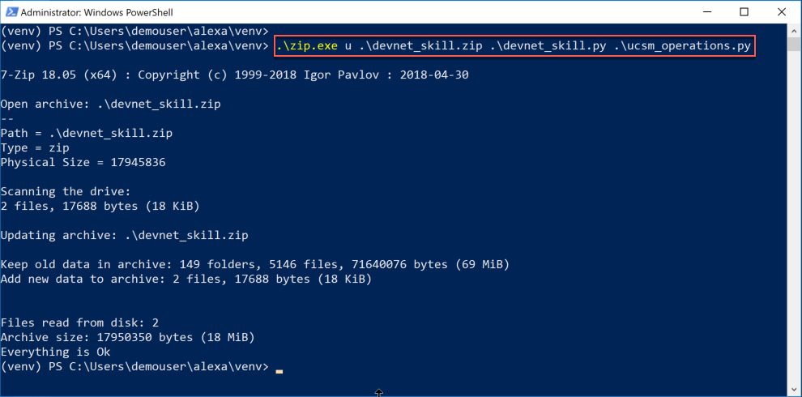
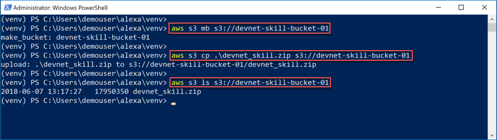
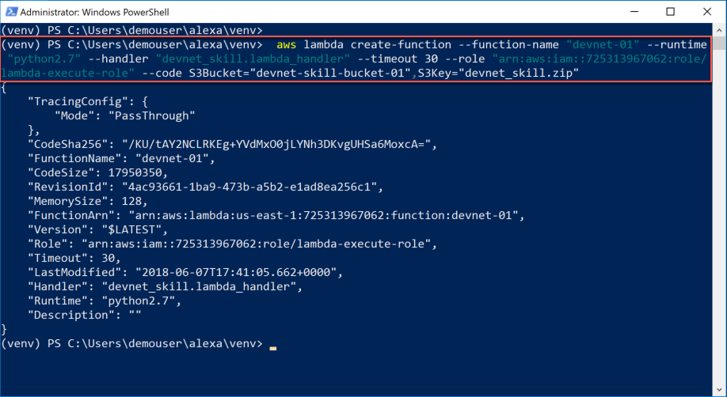
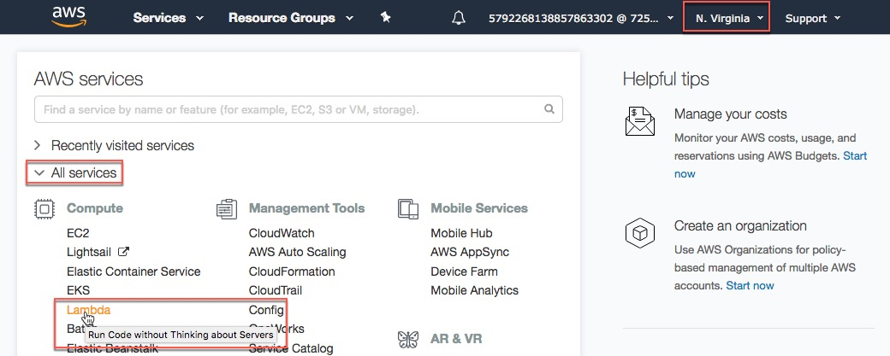
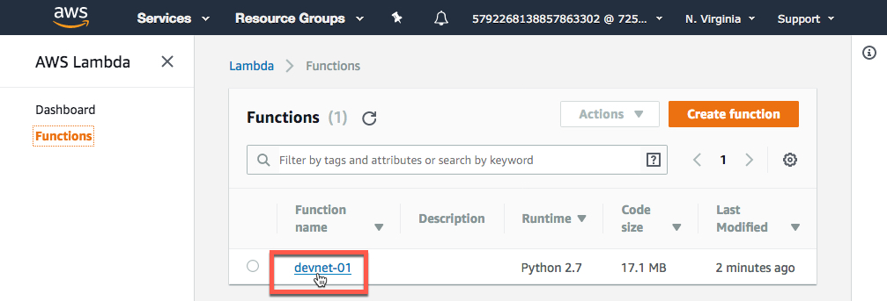
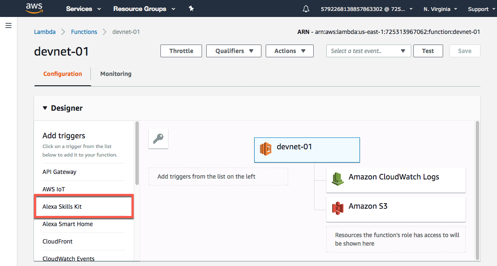
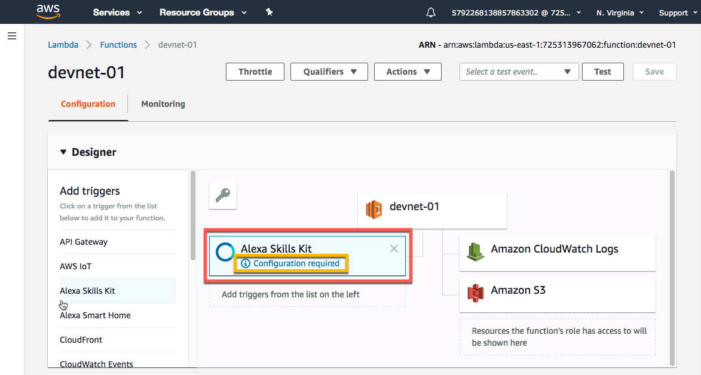
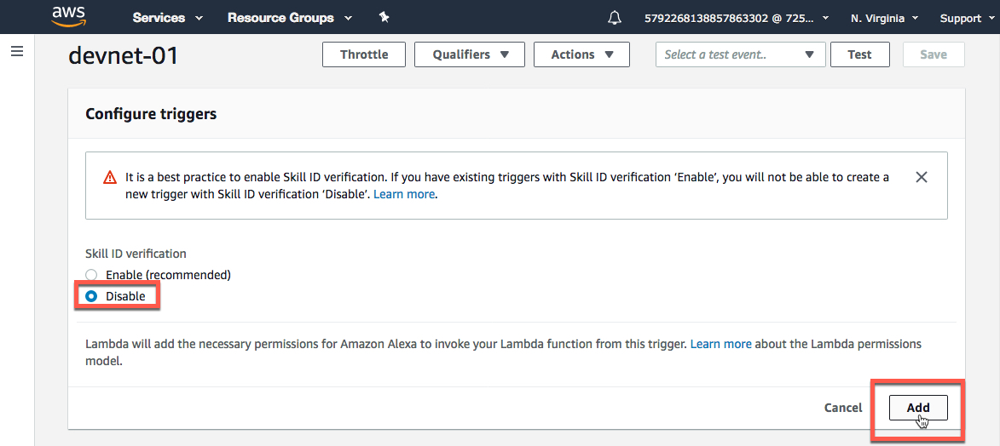
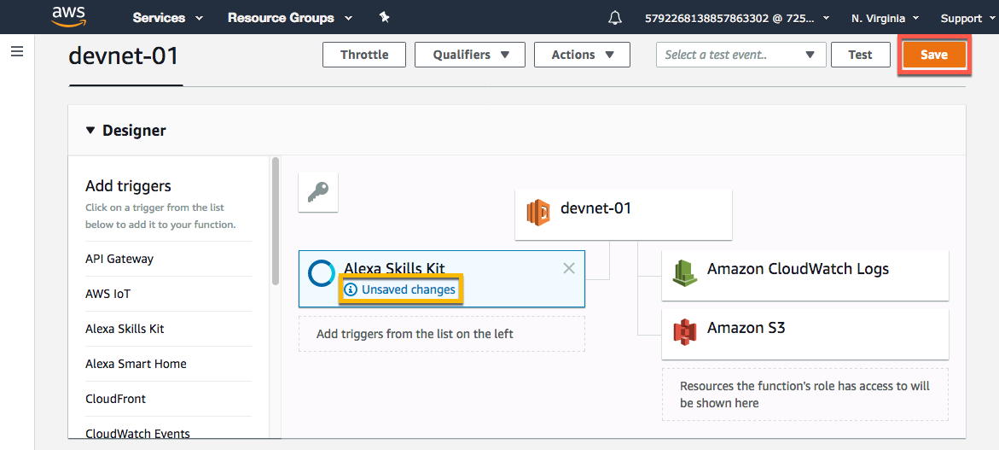
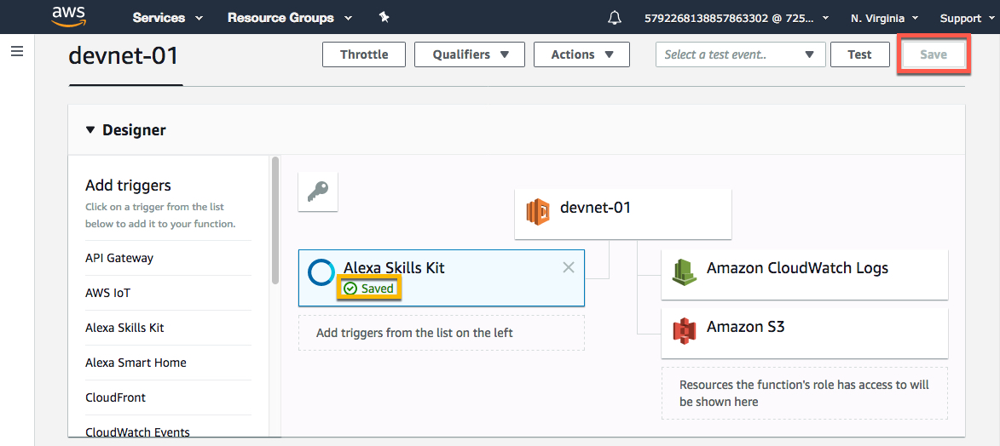

# Step 3: Create the Lamdba function

Lamdba functions are server-less functions stored in AWS. These functions are **triggered** in some way; a point in time, a log file entry, a database event, etc.

When triggered, the service loads the Lambda function (the code) on a server and runs it.

In the case of an Alexa Skill, the service triggers the Lambda function when the Alexa skill "hears" one of its' defined utterances. You'll get to set up the utterances on the next page.

## Package the code
Package the UCS Manager operations code with existing supporting DevNet skill code.

1. Package the code with `zip`.

  When you copied the code from the "**devnet-alexa**" directory to this directory you copied more than just the `ucsm_operations.py` code you also copied the Alexa Skill handler code called `devnet_skill.py` and a package of other supporting code that AWS Lambda needs to run the `ucsm_operations.py` code.

  All this code needs to be packaged as a `zip` file to be uploaded to AWS S3.

  To package up the code, type this command:

    `.\zip.exe u .\devnet_skill.zip .\devnet_skill.py .\ucsm_operations.py`

    and press enter.

  **Package the code**
  <br/><br/>

## Create an S3 bucket and upload the code to the bucket
You are storing the code for your Lambda function in S3. S3 uses the nomenclature "**bucket**" to name the place where you store files.

1. Create an S3 bucket by replacing the `!!` in the command below with **Your AWS Username** from the left-hand lab resources pane.

  - Type this command, and be sure to replace the `!!` with **Your AWS Username** from the lab resources panel:

    `aws s3 mb s3://devnet-skill-bucket-!!`

    and press enter.

2. Upload your code to the S3 bucket.

  Type this command, and be sure to replace the `!!` with **Your AWS Username** from the lab resources panel.

    `aws s3 cp .\devnet_skill.zip s3://devnet-skill-bucket-!!`

    and press enter.

    The **zip file is just over 17MB** and takes a few moments to upload.

3. Verify that the file is in the S3 bucket, be sure to replace the `!!` with **Your AWS Username**.

  - type this command

    `aws s3 ls s3://devnet-skill-bucket-!!`

    and hit enter

  **Make the S3 bucket / upload the Code / verify the upload**
  <br/><br/>

## Create the Lambda function and connect to the code in S3
Now that the code is stored in S3, you can create the Lambda function. **Almost** all the steps to create the Lambda function can be done from the command line.

You'll use the command to create the Lambda function and connect it to the code in the S3 bucket. Then you login into AWS and finish the Lambda function creation from the AWS web interface.

1. Create the Lambda function and connect it to the code in S3.

  The command to create the Lambda function is long, and it is shown in the box below. **You must make _three changes_ to the command**.

  - *Replace* the `!!` in the **function name** with **Your AWS Username** from the lab resources panel.

  - *Replace* the `!!` in the **S3 bucket name** with **Your AWS Username** from the lab resources panel.

  - *Replace* the `0.0.0.0` IP address at the end of the command with **Your UCS Manager IP Address**. You can find your **UCS Manager IP** in the lab resources panel.

    For example, if your UCS Manager IP address is `128.107.70.143`, then the end of the command needs to contain:

    `--environment Variables="{UCSMHOST=128.107.70.143}"`

  - Type this command, and *remember to make the changes listed above before pressing enter!*

    ```code
    aws lambda create-function --function-name "devnet-!!" --runtime "python2.7" --handler "devnet_skill.lambda_handler" --timeout 30 --role "arn:aws:iam::725313967062:role/lambda-execute-role" --code S3Bucket="devnet-skill-bucket-!!",S3Key="devnet_skill.zip" --environment Variables="{UCSMHOST=0.0.0.0}"
    ```

      and press enter.

    **Don't panic**

    - If you press enter and the command failed, you probably didn't replace the `!!` with your with **Your AWS Username**. The `!!` in a Lambda function name are not allowed.

    - If you did not change the IP Address when executing the command and the command was successful, you need to delete the function that was just created and run the creation again.

    To delete the created Lambda function and try the creation command again, type this command, replacing the `!!` with the `--function-name` name with the name you gave your function. In the example below, `devnet-10` is shown as the function name.

    `aws lambda delete-function --function-name devnet-10`

  Here's a brief explanation about the parameters to the command:

  - `--function-name` - What the function will be called.

  - `--runtime` - The language that AWS Lambda uses to run your code.

  - `--handler` - The Python file name and function in that file, called when the system triggers the function.

  - `--timeout` - How long your function runs before it times-out or stops running because it didn't get a response from whatever it was that it was making a request to.

  - `--role` - A reference to the rights this Lambda function has in AWS when running.

  - `--code` - The code you uploaded to the S3 Bucket.

  - `--environment Variables={UCSMHOST=0.0.0.0}` - The indicator for the IP address of **Your UCS Manager**.

  **Create the Lambda function**
  <br/><br/>

## Complete the Lambda function creation
Login to [Amazon Web Services](https://725313967062.signin.aws.amazon.com/console) using this link in this lab, because it points to an organization specifically created for this lab.

1. Sign in using the credentials that you have been supplied with this lab in the lab resources panel.

  - IAM user name - `example5792268138857863302`

  - Password - `example5593599813017169086`

  - Click the **Sign In** button.

  **Sign in to AWS**
  <br/><br/>

2. Select the Lambda Services, by clicking **Lambda** under the "All Services" group.

    <br/><br/>

    Ensure that you are in the "**N. Virginia**" region. This is where your function was created. The region is shown on the right-hand side in the top navigation bar.

    If any other region is showing, you *will not* see your Lambda function!

3. Select **your Lambda Function**, remember **Your AWS Username** appears in the function name, and **not** `!!`.

  **Be sure** to pick **YOUR** Lambda function, this is a shared environment so you may see the Lambda functions that other people created.

  - Click your `devnet-!!` function.

    <br/><br/>

4. Add a trigger by clicking the `Alexa Skills Kit` in the left-hand column.

    <br/><br/>

5. Configure the Alexa skills kit trigger by scrolling down to the "Configuration triggers" section.

    <br/><br/>

6. Disable "Skill ID verification" and finish adding the "Alexa Skills Kit" Trigger:

  - Select the **Disable** radio button.

  - Click the **Add** button.

    <br/><br/>

7. Save the Lambda function:

  - Scroll up.

  - Click the **Save** button.

    <br/><br/>

8. Verify the Lambda function has been saved by viewing the "Saved" status in the "Alexa Skills Kit" trigger box.

    <br/><br/>

## Recap
Good job, so far, you're almost done!  Here's what you've accomplished in this step.

- You **modified** the `ucsm_operations.py` code.

- You **packaged** the changed code with the supporting code for your Lambda function.

- You **created** an AWS S3 Bucket to store your Lambda function code.

- You **uploaded** your code to your S3 Bucket.

- You **created** the Lambda function and connected it to the code in your S3 Bucket.

- You **added** an Alexa Skills Kit trigger to your Lambda function.

Now that your Lambda function is created and set to be triggered from an Alexa Skill, it's time to make the Alexa Skill.

Go to step 4, **Create the Alexa skill**.
