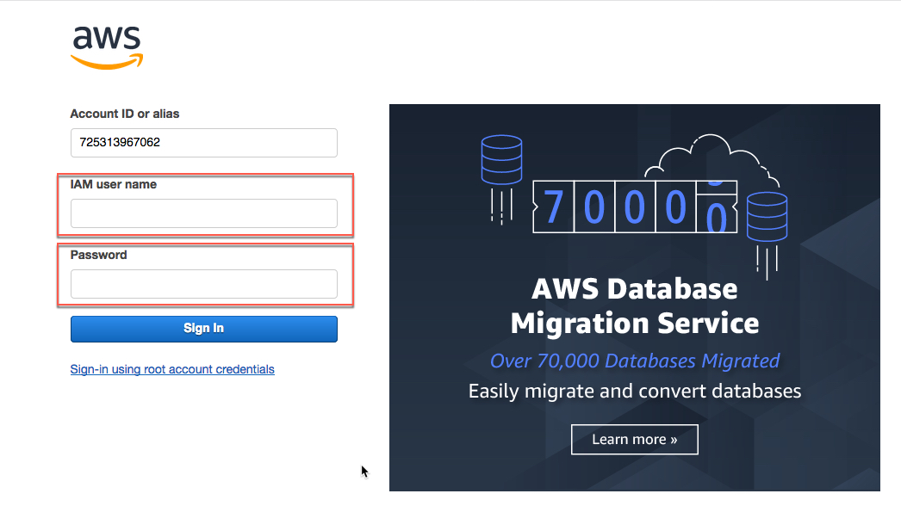

# DevNet Alexa Data Center Skill Lab

## Create the Lamdba Function
Lamdba functions are server-less functions that are stored in AWS. These functions are **triggered** in some way; a point in time, a log file entry, a database event, etc.

When triggered the Lambda function (the code) is loaded on a server and run.

In the case of an Alexa Skill the Lambda function is triggered when the Alexa Skill "hears" one of its' defined utterances. You'll get to setup the utterances on the next page.

#### Package the Code
Package the UCS Manager Operations code with existing supporting DevNet Skill code.

1. Package the code with `zip`.

  When you copied the code from the "**devnet-alexa**" directory to this directory you copied more than just the `ucsm_operations.py` code you also copied the Alexa Skill handler code called `devnet_skill.py` and a package of other supporting code that AWS Lambda needs to run the `ucsm_operations.py` code.

  All this code needs to be packaged as a `zip` file to be uploaded to AWS S3

  - type this command

    `.\zip.exe u .\devnet_skill.zip .\devnet_skill.py .\ucsm_operations.py`

    and hit enter

  **Package the Code**
  <br/><br/>

#### Create an S3 Bucket and Upload the Code to the Bucket
You are storing the code for your Lambda function in S3. S3 uses the nomenclature "**bucket**" to name the place where you store files.

1. Create as S3 Bucket, replace the `!!` in the command below with your **Amazon Echo Dot number**

  - type this command, be sure to replace the `!!` with your **Amazon Echo Dot number**

    `aws s3 mb s3://devnet-skill-bucket-!!`

    and hit enter

2. Upload your code to the S3 bucket

  - type this command, be sure to replace the `!!` with your **Amazon Echo Dot number**

    `aws s3 cp .\devnet_skill.zip s3://devnet-skill-bucket-!!`

    and hit enter

    The **zip file is just over 17MB** and will take a few moments to upload.

3. Verify that the file is in the S3 Bucket, be sure to replace the `!!` with your **Amazon Echo Dot number**

  - type this command

    `aws s3 ls s3://devnet-skill-bucket-!!`

    and hit enter

  **Make the S3 Bucket / Upload the Code / Verify the Upload**
  <br/><br/>

#### Create the Lambda Function and Connect to the Code in S3
The Lambda function can be created, now that code is in S3. **Almost** all the steps to create the Lambda function can be done from the command line.

You'll use the command to create the Lambda function and connect it to the code in the S3 bucket. Then you will login into AWS and finish the Lambda function creation from the AWS web interface.

1. Create the Lambda function and connect it to the code in S3

  The command to create the Lambda function is long, it is shown in the box below. **You need to make THREE CHANGES to the command**.

  - **You need to replace** the `!!` in the **function name** with your **Amazon Echo Dot number**

  - **You need to replace** the `!!` in the **S3 bucket name** with your **Amazon Echo Dot number**

  - **You need to replace** the `0.0.0.0` IP address at the very end of the command **with your** UCS Manager IP Address.

    For example if your UCS Manager IP Address is `128.107.70.143` then the end of the command needs to look as follows:

    `--environment Variables="{UCSMHOST=128.107.70.143}"`

  - type this command, **Remember to make the changes listed above before hitting enter!**

    ```code
    aws lambda create-function --function-name "devnet-!!" --runtime "python2.7" --handler "devnet_skill.lambda_handler" --timeout 30 --role "arn:aws:iam::725313967062:role/lambda-execute-role" --code S3Bucket="devnet-skill-bucket-!!",S3Key="devnet_skill.zip" --environment Variables="{UCSMHOST=0.0.0.0}"
    ```

      and hit enter

    **Don't Panic**

    - If you hit enter and the command failed, you probably didn't replace the `!!` with your **Amazon Echo Dot number**. The `!!` in a Lambda function name are not allowed, that's probably why the command failed.

    - If you hit enter or the command automatically executed and you did not change the IP Address and the command was successful you'll need to delete the function that was just created and run the creation again.

    To delete the created lambda function and try the creation command again, type this command, replace the `!!` with the `--function-name` name with the name you gave your function. In the example below `devnet-10` is shown as the function name.

    `aws lambda delete-function --function-name devnet-10`

  Here's a brief explanation about the parameters to the command

  - `--function-name` - is what the function will be called - devnet-01

  - `--runtime` - is the language that AWS Lambda will use to run your code - python2.7

  - `--handler` - is the python file name and function in that file that will be called when the function is triggered

  - `--timeout` - how long will your function run before it times-out or stops running because it didn't get a response from whatever it was that it was making a request to.

  - `--role` - is a reference to the rights this Lambda function has in AWS when running.

  - `--code` - is the code you uploaded to the S3 bucket

  - `--environment Variables={UCSMHOST=0.0.0.0}` - is the way you indicate the IP address of you UCS Manager

  **Create the Lambda Function**
  <br/><br/>

#### Complete the Lambda Function Creation
Login to [Amazon Web Services](https://725313967062.signin.aws.amazon.com/console) use this link, it points to an organization specifically created for this lab.

1. Sign in using the credentials that you have been supplied with for this lab.

  - IAM user name - `5792268138857863302`

  - Password - `5593599813017169086`

  - ***Click*** the "Sign In" Button

  **Sign In to AWS**
  <br/><br/>

2. Select the Lambda Services

  - Under the "All Services" group ***click*** "Lambda"

    <br/><br/>

    Ensure that you are in the "**N. Virginia**" region. This is where your function was created. The region is shown on the right-hand side in the top navigation bar.

    If any other region is showing you **will not** see your lambda function!

3. Select the Lambda Function, remember your **Amazon Echo Dot number** will be in the function name and **not** `!!`

  - ***Click*** the `devnet-!!` function

    <br/><br/>

4. Add a Trigger

  - ***Click*** the `Alexa Skills Kit` in the left-hand column

    <br/><br/>

5. Configure the Alexa Skills Kit Trigger

  - ***Scroll*** down to the "Configuration triggers" section.

    <br/><br/>

6. Disable "Skill ID verification" and finish adding the "Alexa Skills Kit" Trigger

  - ***Select*** the "Disable" radio button

  - ***Click*** the "Add" button

    <br/><br/>

7. Save the Lambda Function

  - ***Scroll*** up

  - ***Click*** the "Save" button

    <br/><br/>

8. Verify the Lambda Function has been saved

  - ***View*** the "Saved" status in the "Alexa Skills Kit" trigger box

    <br/><br/>

#### What You Have Done So Far!
Good job, so far, you're almost done!  Here's what you've accomplished in this step.

- You **modified** the `ucsm_operations.py` code

- You **packaged** the changed code with the supporting code for your Lambda function

- You **created** an AWS S3 Bucket to store your Lambda function code

- You **uploaded** your code to your S3 Bucket

- You **created** the Lambda function and connected it to the code in your S3 Bucket

- You **added** an Alexa Skills Kit trigger to your Lambda function

Now that your Lambda function is created and set to be triggered from an Alexa Skill, it's time to make the Alexa Skill.

Goto Page 4 - **Create the Alexa Skill**
