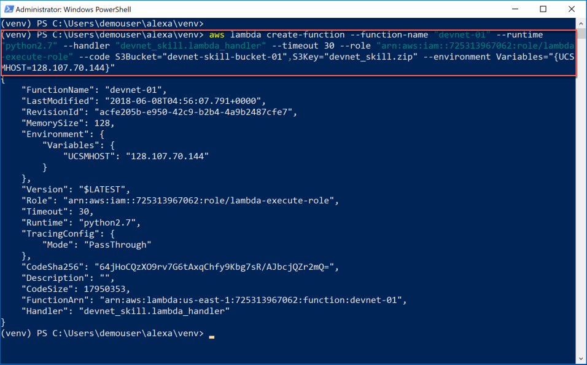

# DevNet Alexa Data Center Skill Lab

## Create the Lamdba Function
Lamdba functions are server-less functions that are stored in AWS. These functions are **triggered** in some way; a point in time, a log file entry, a database event, etc.

When triggered the Lambda function (the code) is loaded on a server and run.

In the case of an Alexa Skill the Lambda function is triggered when the Alexa Skill "hears" one of its' defined utterances. You'll get to setup the utterances on the next page.

#### Change and Package The Code
First you need to make a small modification to the Lambda code. Then package the changed code with existing supporting supporting code.

1. Change the code so that it uses your assigned **UCS Manager** You should already be in the **venv** directory

  - type this command

    `notepad ucsm_operations.py`

    and hit enter

  - enter your UCS Manager IP address, where the code looks like this:

    `ucsmhost = "Your UCS Manager IP"`

    Change "Your UCS Manager IP" to your assigned UCS Manager IP. For example if your UCS Manager IP address is `10.10.10.10` then the code will look as shown below

    `ucsmhost = "10.10.10.10"`

  - Save the changes and exit out of notepad

  Update the ucsm_operations.py Code:

  <br/><br/>

  <br/><br/>

2. Package the changed code with `zip`.

  When you copied the code from the "**devnet-alexa**" directory to this directory you copied more than just the `ucsm_operations.py` code you also copied the Alexa Skill handler code called `devnet_skill.py` and a package of other supporting code that AWS Lambda needs to run the `ucsm_operations.py` code.

  All this code needs to be packaged as a `zip` file to be uploaded to AWS S3

  - type this command

    `.\zip.exe u .\devnet_skill.zip .\devnet_skill.py .\ucsm_operations.py`

    and hit enter

  Package the Code:

  <br/><br/>

#### Create an S3 Bucket and Upload the Code to the Bucket
You are storing the code for your Lambda function in S3. S3 uses the nomenclature "**bucket**" to name the place where you store files.

1. Create as S3 Bucket, replace the `XX` in the command below with your **Amazon Dot number**

  - type this command

    `aws s3 mb s3://devnet-skill-bucket-XX`

    and hit enter


2. Upload your code to the S3 bucket

  - type this command

    `aws s3 cp .\devnet_skill.zip s3://devnet-skill-bucket-01`

    and hit enter

    The zip file is just over 17MB and will take a few moments to upload.

3. Verify that the file is in the S3 Bucket

  - type this command

    `aws s3 ls s3://devnet-skill-bucket-01`

    and hit enter

  Make the S3 Bucket / Upload the Code / Verify the Upload:

  <br/><br/>

#### Create the Lambda Function and Connect to the Code in S3
The Lambda function can be created now that code is in S3. **Almost** all the steps to create the Lambda function can be done from the command line.

You'll run the command to create the Lambda function and connect it to the code in the S3 bucket. Then you will login into AWS and finish the Lamdba function creation from the AWS web interface.

1. Create the Lambda function and connect it to the code in S3

  - type this command

    ```python
    aws lambda create-function --function-name "devnet-01" --runtime "python2.7" --handler "devnet_skill.lambda_handler" --timeout 30 --role "arn:aws:iam::725313967062:role/lambda-execute-role" --code S3Bucket="devnet-skill-bucket-01",S3Key="devnet_skill.zip"
    ```

    and hit enter

  Here's a brief explanation about the parameters to the command

  - `--function-name` - is what the function will be called - devnet-01

  - `--runtime` - is the language that AWS Lambda will use to run your code - python2.7

  - `--handler` - is the python file name and function in that file that will be called when the function is triggered

  - `--timeout` - how long will your function run before it times-out or stops running because it didn't get a response from whatever it was that it was making a request to.

  - `--role` - is a reference to the rights this Lambda function has in AWS when running.

  - `--code` - is the code you uploaded to the S3 bucket

  Create the Lambda Function:

  <br/><br/>

#### Complete the Lambda Function Creation
Login to [Amazon Web Services](https://725313967062.signin.aws.amazon.com/console) use this link, it points to an organization specifically created for this lab

1. Sign in using the credentials that you have been supplied with for this lab.

  - IAM user name - `5792268138857863302`

  - Password - `5593599813017169086`

  - ***Click*** the "Sign In" Button

  Sign In to AWS:

  <br/><br/>

2. Select the Lambda Services

  - Under the "All Services" group ***click*** "Lambda"

    <br/><br/>

3. Select the Lambda Function

  - ***Click*** the `devnet-01` function

    <br/><br/>

4. Add a Trigger

  - ***Click*** the `Alexa Skills Kit` in the left-hand column

    <br/><br/>

5. Configure the Alexa Skills Kit Trigger

  - ***Scroll*** down to the "Configuration triggers" section.

    <br/><br/>

6. Disable "Skill ID verification" and finish adding the "Alexa Skills Kit" Trigger

  - ***Select*** the "Disable" radio button

  - ***Click*** the "Add" button

    <br/><br/>

7. Save the Lambda Function

  - ***Scroll*** up

  - ***Click*** the "Save" button

    <br/><br/>

8. Verify the Lambda Function has been saved

  - ***View*** the "Saved" status in the "Alexa Skills Kit" trigger box

    <br/><br/>

#### What You Have Done So Far!
Good job, so far, you're almost done!  Here's what you've accomplished in this step.

- You **modified** the `ucsm_operations.py` code

- You **packaged** the changed code with the supporting code for your Lambda function

- You **created** an AWS S3 Bucket to store your Lambda function code

- You **uploaded** your code to your S3 Bucket

- You **created** the Lambda function and connected it to the code in your S3 Bucket

- You **added** an Alexa Skills Kit trigger to your Lambda function

Now that your Lambda function is created and set to be triggered from an Alexa Skill, it's time to make the Alexa Skill.

Goto Page 4 - **Create the Alexa Skill**
