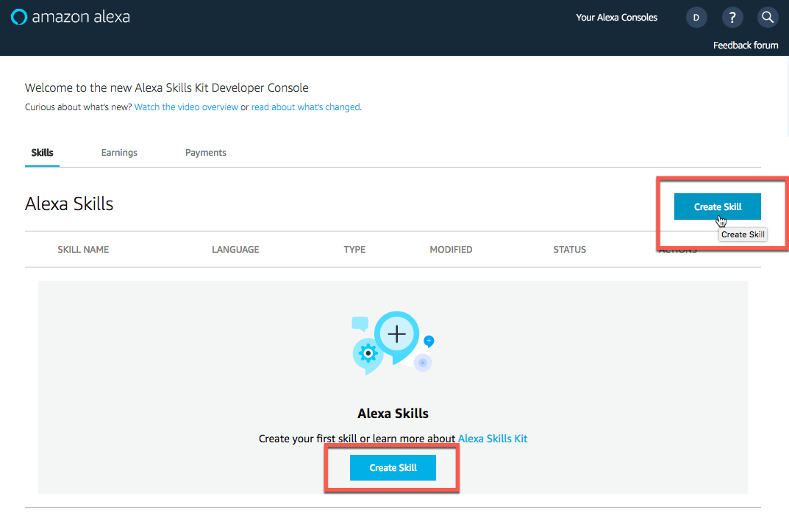
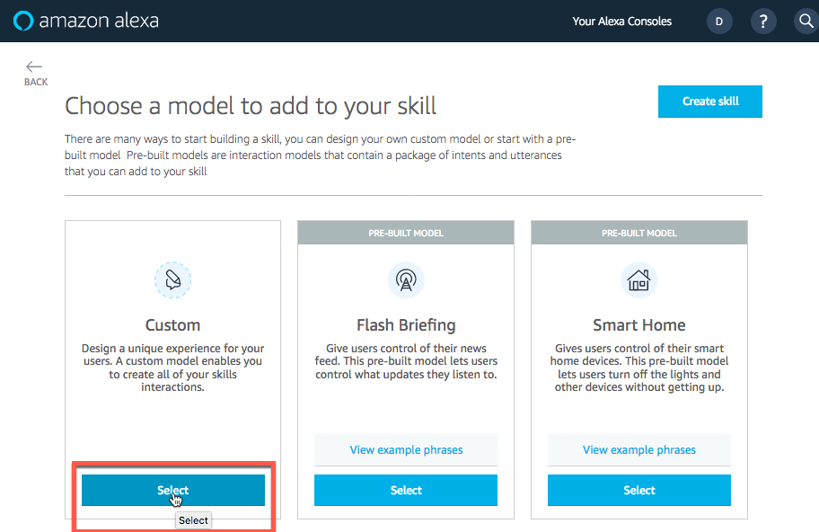

# Step 4: Create the Alexa Skill
To get to this point:

  - You set up a Development Environment.

  - You updated Python code and packaged it.

  - You created an S3 Bucket and uploaded the code package.

  - You created the Lambda function and added an Alexa Skill trigger.

1. Login to [developer.amazon.com](https://developer.amazon.com) and create the skill.

  Sign in using the credentials that you have been supplied with for this lab, `!!` represents your **Amazon Echo Dot number**.

  - Click the **Sign In** button.

  - Enter email - `devnetuseralex!!@cisco.com`

  - Enter the password, `cisco123`. This is your actual password.

  - Click **Sign In** in the upper-right corner.

      

      

2. Navigate to the Alexa "**Skills**"" Console by hovering over "Your Alexa Consoles" in the upper-right corner and clicking **Skills**.

      

3. Create a Skill.

    **Note**: It is possible that you may see an existing *Skill*. Unlike the AWS accounts, the Amazon Developer Account is not shared.  When you are working on this lab **Only You** have access to the Amazon Developer Account that you were assigned.

    If you see an existing *Skill*, please delete it by clicking the "Delete" link. Then click, "Yes, Delete Skill".

        

        

  - Click either **Create Skill** button.

        

4. Enter the Skill Name, "DevNet Skill".

  - Enter "DevNet Skill" in the *SkillName* field.

  - Click the "Next" button.

      

5. Choose a model to add to your skill.

  - Click the **Select** button in the "Custom" box.

  - Click the **Create Skill** button.

      

      

## Configure the Alexa DevNet Skill

1. Set an Invocation Name and create your first Intent.

  - Click Step "1. Invocation Name" in the *Skill builder checklist*.

  - Enter "devnet" in the *Skill Invocation Name* field

    This is the name you'll say when invoking your skill. That is, your requests start with the phrase "Alexa, ask devnet..."

    Next you'll add an "**Intent**" and define an utterance that is tied to that "**Intent**".

  - Click "+ Add" in the left-hand column, next to the label *Intents(4)*.

      

      

2. Add the "**GetFaults**" intent to retrieve faults from the UCS Manager.

  The *Create custom intent* radio button will already be selected. Create an intent called "GetFaults":

  - Enter "GetFaults" in the *Enter name for intent* field.

  - Click the **Create custom intent** button.

      

3. Add the Sample Utterance, "What is my fault count", to invoke the "GetFaults" intent.

  - Enter `What is my fault count` in the *What might a user say to invoke this intent?* field.

    This utterance when "heard" by Alexa passes the "GetFaults" intent to the Python code and triggers the running of a method in the Lambda function to retrieve the critical, major, minor, and warning faults from the UCS Manager. Alexa then respond with the counts of each fault.

    To invoke this intent you'll say, "Alexa, ask devnet, What is my fault count?"

  - Click the "**+**" sign on the right-hand side of the field.

      

      

4. Add the "**AddVlan**" intent to add a VLAN (Virtual LAN) to the UCS Manager.

  - Click **+ Add** in the left-hand column, next to the label *Intents(5)*

  The *Create custom intent* radio button will already be selected. Create an intent called "AddVlan"

  - Enter "AddVlan" in the *Enter name for intent* field.

  - Click the **Create custom intent** button.

      

5. Add the Sample Utterance `Add V Lan {vlan_id}` to invoke the "AddVlan" intent.

  - Enter "Add V Lan {vlan_id}" in the *What might a user say to invoke this intent?* field.

    This utterance, when "heard" by Alexa, passes the "AddVlan" intent along with the spoken VLAN number to the Python code and triggers the running of a method in the Lambda function to create a VLAN on the UCS Manager. Alexas responds with the results of the add request.

    To invoke this intent, you'll say, "Alexa, ask devnet Add VLAN 100."

    While typing the intent, when you start to type the string "{vlan_id}", a dialog box pops up asking you to select an existing slot. Slots are places for variable components of your utterance. You will add a new slot.

  - Enter "vlan_id" in the *slot name* field.

  - Click the **Add** button.

  - Click the "**+**" sign on the right-hand side of the field.

      

6. Set the Slot Type for the "vlan_id" Slot.

  - ***Scroll*** to the "Intent Slots" section just below the "Sample Utterances" section.

  - Click the "Select a slot type" *drop-down* list.

  - Select the Type "AMAZON.NUMBER".

      

7. Add the "**ProvisionServer**" intent to provision a server on UCS Manager.

  - Click "+ Add" in the left-hand column, next to the label *Intents(6)*

    The *Create custom intent* radio button will already be selected. Create an intent called "ProvisionServer".

  - Enter "ProvisionServer" in the *Enter name for intent* field

  - Click the "Create custom intent" Button

      

8. Add the Sample Utterance "Provision a server" to invoke the "ProvisionServer" intent.

  - Enter `Provision a server` in the *What might a user say to invoke this intent?* field

    This utterance when "heard" by Alexa will pass the "ProvisionServer" intent to the Python code and trigger the running of a method in the Lambda function to retrieve provision a server in the UCS Manager. Alexa responds with the status of the request, including the server number and chassis it is located in, along with the name of the Service Profile assigned to the server.

    To invoke this intent you'll say, "Alexa, ask devnet, provision a server"

  - Click the "**+**" sign on the right-hand side of the field

      

## Build and save the intent and utterance model and connect the Alexa Skill to the Lambda function
Now that the Intents and their related Utterances are defined you need to "Build" and "Save" the model.

With the model built you can specify an "Endpoint" that the Alex Skill will use when invoked. The Endpoint you'll specify is the Lambda function.

1. Build and save the model:

  - Click the **Build Model** button.

  - Click the **Save Model** button.

      

2. Specify an Endpoint to connect the Alexa Skill to the Lambda function.

  - Click "Endpoint" in the left-hand column.

      

  - Select the "AWS Lambda ARN" radio button.

      

3. Copy the Lambda function ARN (Amazon Resource Number) from the Lambda function page on AWS. If your session at aws.amazon.com has timed out, [use this link to log back in](https://725313967062.signin.aws.amazon.com/console) because it points to an organization specifically created for this Lab.

  - Select and copy the Lambda ARN.

      

  - Paste the Lambda ARN into the "Default Region" *field*.

  - Click the **Save Endpoints** button.

      

## Recap
Good job, you are done creating the Alexa Skill. Here's what you've accomplished in this step.

- You **created** the "DevNet Skill".

- You **created** Intents and Utterances.

- You **built** the DevNet Skill Model.

- You **added** an Endpoint to the Skill. The endpoint is the Lambda function.

Now that your DevNet Alexa Skill is completed, it is time to test if your skill works.

Go to page 5, **Manage the Data Center with voice commands**.
