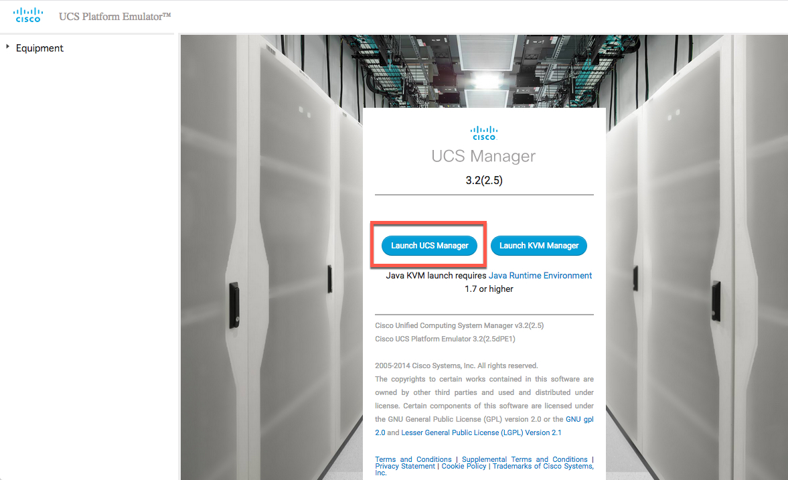
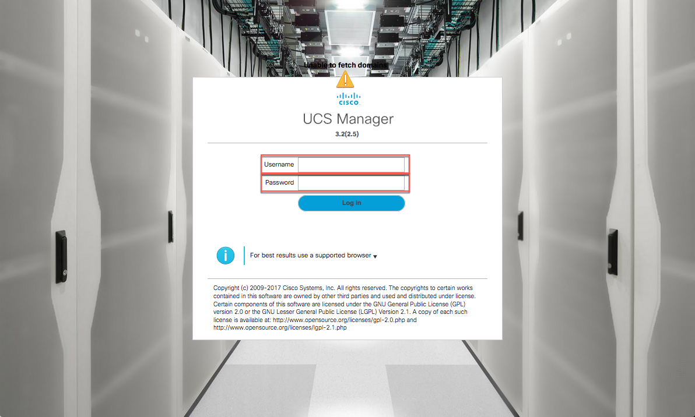
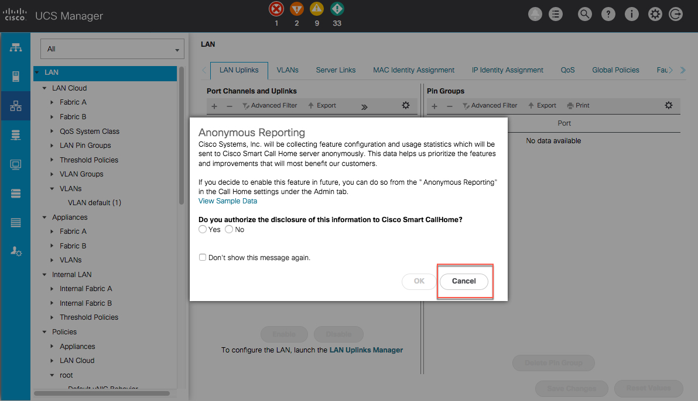
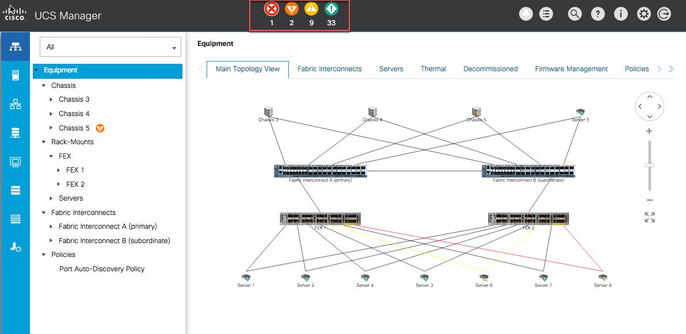

# DevNet Alexa Data Center Skill Lab

## Manage the Data Center with Voice
It is time to test out your Alexa DevNet Skill and see if you can manage your Data Center Infrastructure with your voice.

You are going to utilize the UCS Manager interface to view the requests you make of your Skill in action.

#### Launch UCS Mangager

1. Browse to the IP Address or your UCS Manager

  - ***Click*** the "Launch UCS Manager" button

        

    The interface may take a few moments to load

  - ***Enter*** the UCS Manager Credentials

    - Username - `admin`
    - Password - `password`

  - ***Click*** the "Login" button

        

  - ***Click*** the "Cancel" button if you receive the "Anonymous Reporting" pop-up *dialog*

        

#### Test the GetFaults Intent

1. Using your Amazon Echo Dot

  - ***Speak*** - "Alexa ask devnet what is my fault count?"

    After a few moments the Echo (Alexa) should respond with the overall system fault counts found at the top of the UCS Manager Interface.

        

#### Congratulations!
Congratulations You Completed the - **DevNet Alexa Data Center Skill Lab**. We at DevNet hoped you enjoyed it, learned something new and may even take your new knowledge back to your environment and put it into action.
