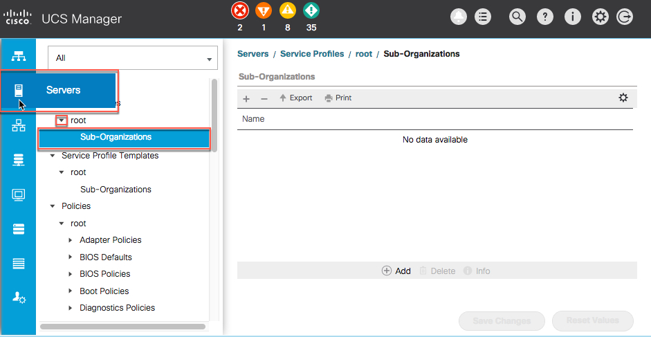
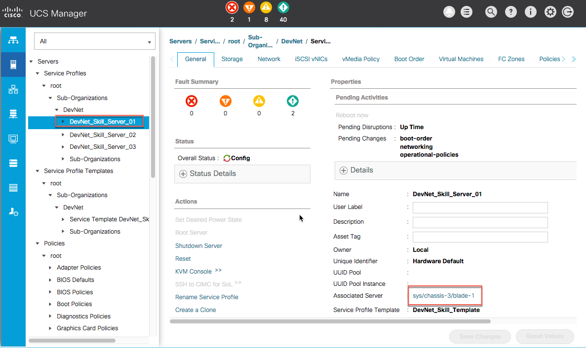
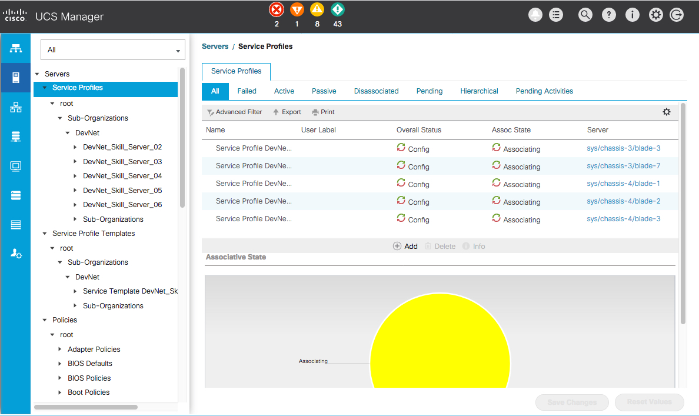
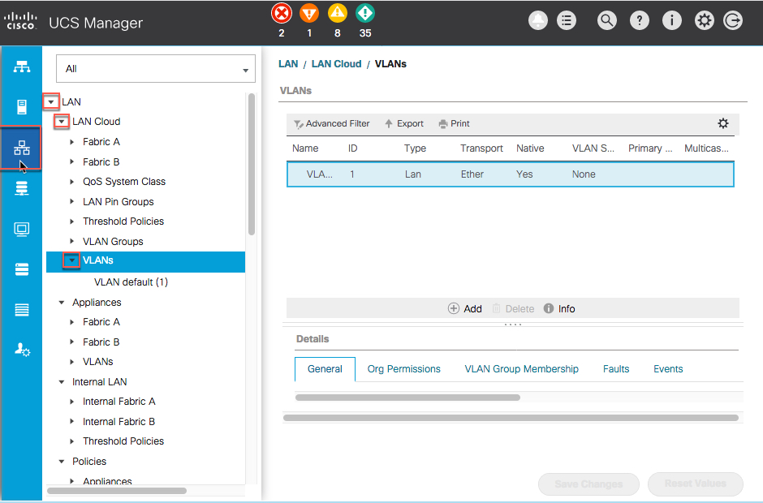
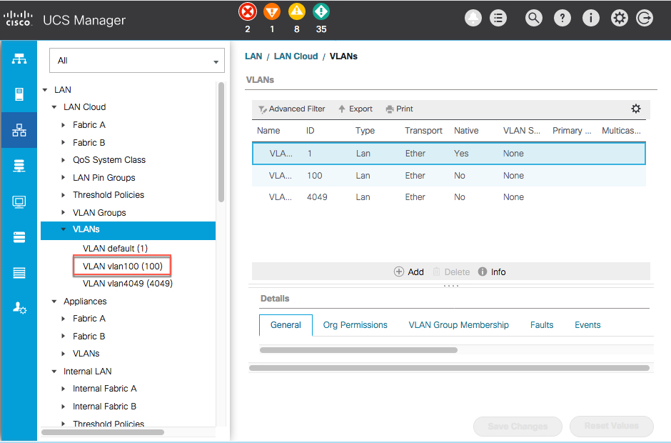

# Step 5: Manage the Data Center with voice commands

It's time to test out your Alexa DevNet Skill and see if you can manage your Data Center Infrastructure with your voice.

You are going to utilize the UCS Manager interface to view the requests you make of your Skill, in action.

#### Launch UCS Manager
1. Open a new browser tab and browse to the IP address of your UCS Manager:

  - Click the **Launch UCS Manager** button.

        

    The interface may take a few moments to load.

  - Enter the UCS Manager Credentials:

    - Username - `admin`
    - Password - `password`

  - Click the **Login** button.

        

  - Click the **Cancel** button if you receive an "Anonymous Reporting" pop-up dialog.

        

## Test the GetFaults intent
1. Using your Amazon Echo Dot:

  - ***Speak*** - "Alexa, ask devnet, what is my fault count?"

    After a few moments the Echo (Alexa) should respond with the status of the request. If successful, Alexa responds with the overall system fault counts found at the top of the UCS Manager Interface.

        

## Test the ProvisionServer intent
1. Using your Amazon Echo Dot:

  - ***Speak*** - "Alexa, ask devnet to provision a Server."

    After a few moments the Echo (Alexa) should respond with the status of the request. If successful, Alexa responds with the server blade number and chassis number as well as the service profile name that was assigned to the server and the name of the organization in which the service profile resides.

    All service profiles are provisioned in the "DevNet" organization. To view the activity in action, in the UCS Manager interface:

  - Click the "Servers" icon.

  - Click the icon next to "root" to expose the "Sub-Organizations" header.

    The first time you request the provisioning of a server, the manager creates the "DevNet" organization and names the first service profile, "DevNet_Skill_Server_01".

    Each additional request increments the suffix number to one greater than the highest existing suffix number.

      

      

      

## Test the AddVlan intent
1. Using your Amazon Echo Dot:

  - ***Speak*** - "Alexa, ask devnet to add VLAN 100."

    After a few moments, the Echo (Alexa) should respond with the status of the request. If successful, Alexa responds with a message indicating the result of the AddVlan intent.

      All VLANs are provisioned as "Lan Cloud" Global VLANs. To view the activity in action, in the UCS Manager interface:

  - Click the "Network" icon.

  - Click the icon next to "Lan" to expose the "Lan Cloud" header.

  - Click the icon next to "Lan Cloud" to expose the "VLANs" header.

  - Click the icon next to "VLANs" to expose any existing VLANs.

      

      

    Requesting invalid VLANs should fail, type these intents

    "Alexa, ask devnet to Add Vlan 1"

    "Alexa, ask devnet to Add Vlan 4048"

    "Alexa, ask devnet to Add Vlan 5000"

    If a VLAN already exists, Alexa responds with that information as well.

## Congratulations!
Congratulations! You completed the - **DevNet Alexa data center skill lab**. We at DevNet hoped you enjoyed it, learned something new, and may even take your new knowledge back to your environment and put it into action.
